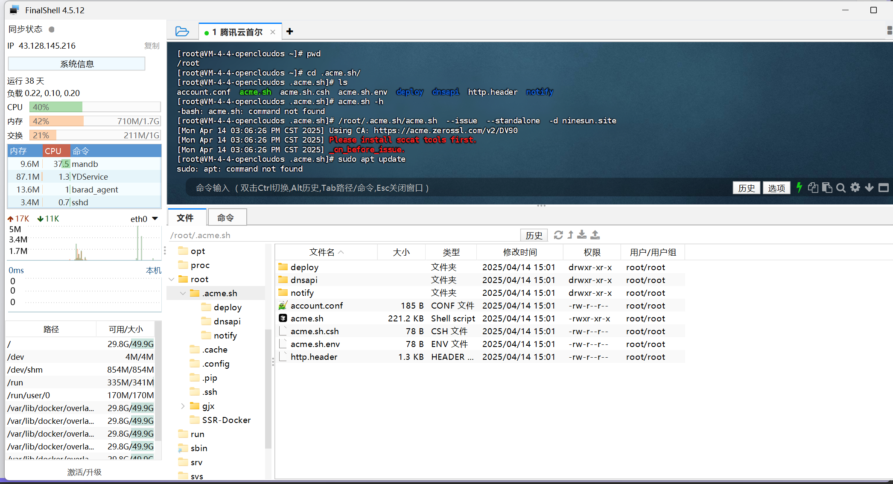
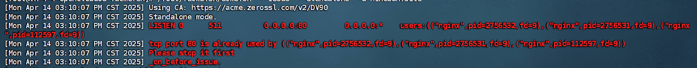
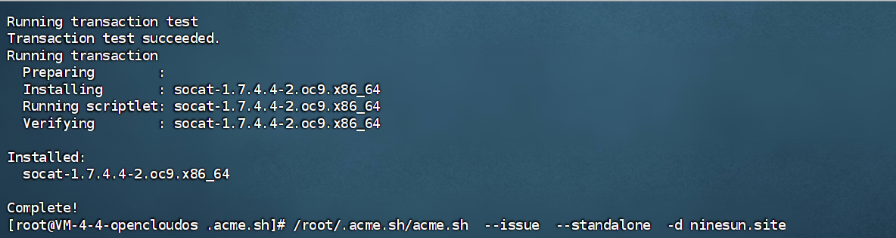
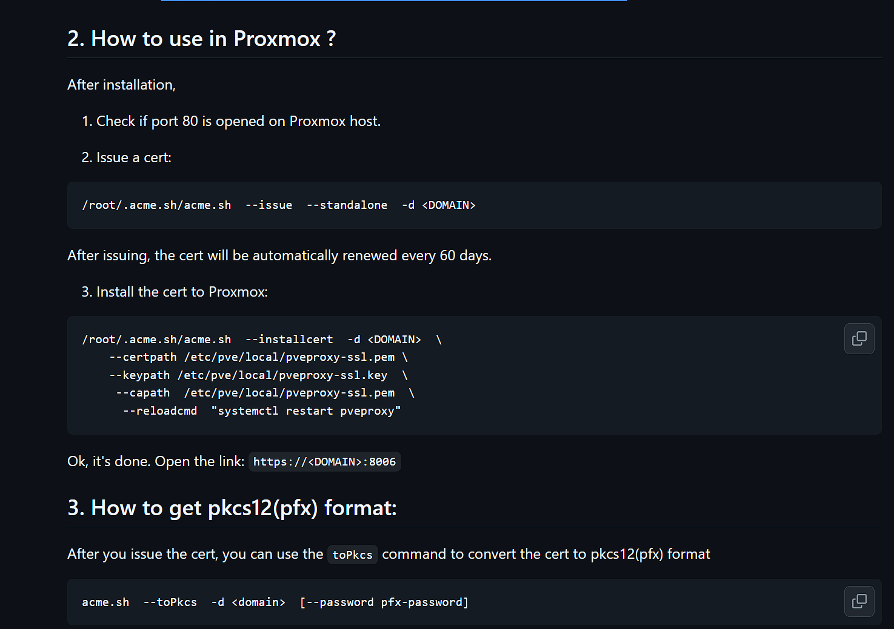

1.下载 


2. 申请时报错
3. 

4. sudo yum install socat -y

5.  得先停掉nginx
6.  暂时保存下nginx启动命令
   ```
    nginx: master process /www/server/nginx/sbin/nginx -c /www/server/nginx/conf/nginx.conf  
   ```
   
7.  

  ```shell

  [root@VM-4-4-opencloudos .acme.sh]# /root/.acme.sh/acme.sh  --issue  --standalone  -d ninesun.site
[Mon Apr 14 03:13:55 PM CST 2025] Using CA: https://acme.zerossl.com/v2/DV90
[Mon Apr 14 03:13:55 PM CST 2025] Standalone mode.
[Mon Apr 14 03:13:55 PM CST 2025] Account key creation OK.
[Mon Apr 14 03:13:55 PM CST 2025] No EAB credentials found for ZeroSSL, let's obtain them
[Mon Apr 14 03:13:57 PM CST 2025] Registering account: https://acme.zerossl.com/v2/DV90
[Mon Apr 14 03:14:00 PM CST 2025] Registered
[Mon Apr 14 03:14:00 PM CST 2025] ACCOUNT_THUMBPRINT='8_hzuI0VuvWCIf_WMK9Pvq471op5Q5zQ1S_FcFsfUls'
[Mon Apr 14 03:14:00 PM CST 2025] Creating domain key
[Mon Apr 14 03:14:00 PM CST 2025] The domain key is here: /root/.acme.sh/ninesun.site_ecc/ninesun.site.key
[Mon Apr 14 03:14:00 PM CST 2025] Single domain='ninesun.site'
[Mon Apr 14 03:14:05 PM CST 2025] Getting webroot for domain='ninesun.site'
[Mon Apr 14 03:14:05 PM CST 2025] Verifying: ninesun.site
[Mon Apr 14 03:14:05 PM CST 2025] Standalone mode server
[Mon Apr 14 03:14:09 PM CST 2025] Processing. The CA is processing your order, please wait. (1/30)
[Mon Apr 14 03:14:14 PM CST 2025] Success
[Mon Apr 14 03:14:14 PM CST 2025] Verification finished, beginning signing.
[Mon Apr 14 03:14:14 PM CST 2025] Let's finalize the order.
[Mon Apr 14 03:14:14 PM CST 2025] Le_OrderFinalize='https://acme.zerossl.com/v2/DV90/order/lv_HQNnFk0qPnuMErV4bxg/finalize'
[Mon Apr 14 03:14:18 PM CST 2025] Order status is 'processing', let's sleep and retry.
[Mon Apr 14 03:14:18 PM CST 2025] Sleeping for 15 seconds then retrying
[Mon Apr 14 03:14:34 PM CST 2025] Polling order status: https://acme.zerossl.com/v2/DV90/order/lv_HQNnFk0qPnuMErV4bxg
[Mon Apr 14 03:14:40 PM CST 2025] Downloading cert.
[Mon Apr 14 03:14:40 PM CST 2025] Le_LinkCert='https://acme.zerossl.com/v2/DV90/cert/Ey19rI3k8_1cjnlAYvOLyQ'
[Mon Apr 14 03:14:48 PM CST 2025] Cert success.
-----BEGIN CERTIFICATE-----
MIID+zCCA4GgAwIBAgIRALISOi437e5EuIcxlQAe+7AwCgYIKoZIzj0EAwMwSzEL
MAkGA1UEBhMCQVQxEDAOBgNVBAoTB1plcm9TU0wxKjAoBgNVBAMTIVplcm9TU0wg
RUNDIERvbWFpbiBTZWN1cmUgU2l0ZSBDQTAeFw0yNTA0MTQwMDAwMDBaFw0yNTA3
MTMyMzU5NTlaMBcxFTATBgNVBAMTDG5pbmVzdW4uc2l0ZTBZMBMGByqGSM49AgEG
CCqGSM49AwEHA0IABFCFpLMHNsW9PHydzOdHrd0jSi6WFO5MTJsQn74JBQLwLrhj
fpmOyOkeVpIX3QrQHSo8sPwEncmXtvFlo2RwDuyjggJ4MIICdDAfBgNVHSMEGDAW
gBQPa+ZLzjlHrvZ+kB558DCRkshfozAdBgNVHQ4EFgQU63tRcL5/4Wy+kSI1+wei
F2PjLlYwDgYDVR0PAQH/BAQDAgeAMAwGA1UdEwEB/wQCMAAwHQYDVR0lBBYwFAYI
KwYBBQUHAwEGCCsGAQUFBwMCMEkGA1UdIARCMEAwNAYLKwYBBAGyMQECAk4wJTAj
BggrBgEFBQcCARYXaHR0cHM6Ly9zZWN0aWdvLmNvbS9DUFMwCAYGZ4EMAQIBMIGI
BggrBgEFBQcBAQR8MHowSwYIKwYBBQUHMAKGP2h0dHA6Ly96ZXJvc3NsLmNydC5z
ZWN0aWdvLmNvbS9aZXJvU1NMRUNDRG9tYWluU2VjdXJlU2l0ZUNBLmNydDArBggr
BgEFBQcwAYYfaHR0cDovL3plcm9zc2wub2NzcC5zZWN0aWdvLmNvbTCCAQQGCisG
AQQB1nkCBAIEgfUEgfIA8AB1AN3cyjSV1+EWBeeVMvrHn/g9HFDf2wA6FBJ2Ciys
u8gqAAABljMmJs0AAAQDAEYwRAIgK3i90gFR5fos0oeiP3uYzwKigpx3/UA5qxfT
BUMshKkCIEDrt6h/sIBeNLOrIeXvxD3AgkP2eJBabBhqpaJGJ5M2AHcADeHyMCvT
DcFAYhIJ6lUu/Ed0fLHX6TDvDkIetH5OqjQAAAGWMyYmrwAABAMASDBGAiEApLwv
So3yow2CocTYIGoH6nm8gHxG5WvtLTHNRkNKu6gCIQCHd1Z8Rg3A47lcweUVToTI
EV25nqu3Xj5LG0gEafrPHDAXBgNVHREEEDAOggxuaW5lc3VuLnNpdGUwCgYIKoZI
zj0EAwMDaAAwZQIxALMSj9PAuw0FGWNvk1lCszpFZrhyKgWMhC6xd2msbGiDSfQK
lb6nMUClEF4YhAiZaAIweZ48ZCFhLHZMa9mBwoncXbMnEK+IeoHXffXoTDnQiSJJ
TIN0VRqN2Y/45VvvOaDd
-----END CERTIFICATE-----
[Mon Apr 14 03:14:48 PM CST 2025] Your cert is in: /root/.acme.sh/ninesun.site_ecc/ninesun.site.cer
[Mon Apr 14 03:14:48 PM CST 2025] Your cert key is in: /root/.acme.sh/ninesun.site_ecc/ninesun.site.key
[Mon Apr 14 03:14:48 PM CST 2025] The intermediate CA cert is in: /root/.acme.sh/ninesun.site_ecc/ca.cer
[Mon Apr 14 03:14:48 PM CST 2025] And the full-chain cert is in: /root/.acme.sh/ninesun.site_ecc/fullchain.cer
  ```

8. 问下ai怎么改nginx 配置文件
改成这样了

但是页面上还是显示不安全。。。   可以用ssl访问了

```
user  www www;
worker_processes auto;
error_log  /www/wwwlogs/nginx_error.log  crit;
pid        /www/server/nginx/logs/nginx.pid;
worker_rlimit_nofile 51200;

stream {
    log_format tcp_format '$time_local|$remote_addr|$protocol|$status|$bytes_sent|$bytes_received|$session_time|$upstream_addr|$upstream_bytes_sent|$upstream_bytes_received|$upstream_connect_time';
  
    access_log /www/wwwlogs/tcp-access.log tcp_format;
    error_log /www/wwwlogs/tcp-error.log;
    include /www/server/panel/vhost/nginx/tcp/*.conf;
}

events
    {
        use epoll;
        worker_connections 51200;
        multi_accept on;
    }

http
    {
        include       mime.types;
		#include luawaf.conf;

		include proxy.conf;
        lua_package_path "/www/server/nginx/lib/lua/?.lua;;";

        default_type  application/octet-stream;

        server_names_hash_bucket_size 512;
        client_header_buffer_size 32k;
        large_client_header_buffers 4 32k;
        client_max_body_size 50m;

        sendfile   on;
        tcp_nopush on;

        keepalive_timeout 60;

        tcp_nodelay on;

        fastcgi_connect_timeout 300;
        fastcgi_send_timeout 300;
        fastcgi_read_timeout 300;
        fastcgi_buffer_size 64k;
        fastcgi_buffers 4 64k;
        fastcgi_busy_buffers_size 128k;
        fastcgi_temp_file_write_size 256k;
		fastcgi_intercept_errors on;

        gzip on;
        gzip_min_length  1k;
        gzip_buffers     4 16k;
        gzip_http_version 1.1;
        gzip_comp_level 2;
        gzip_types     text/plain application/javascript application/x-javascript text/javascript text/css application/xml application/json image/jpeg image/gif image/png font/ttf font/otf image/svg+xml application/xml+rss text/x-js;
        gzip_vary on;
        gzip_proxied   expired no-cache no-store private auth;
        gzip_disable   "MSIE [1-6]\.";

        limit_conn_zone $binary_remote_addr zone=perip:10m;
		limit_conn_zone $server_name zone=perserver:10m;

        server_tokens off;
        access_log off;


    server {
    listen 80;
    server_name platform.ninesun.site;
    
    location / {
        proxy_pass http://127.0.0.1:8888;
        proxy_set_header Host $host;
        proxy_set_header X-Real-IP $remote_addr;
        proxy_set_header X-Forwarded-For $proxy_add_x_forwarded_for;
        proxy_set_header X-Forwarded-Proto $scheme;
    }
    

    access_log /www/wwwlogs/platform-access.log;
    error_log /www/wwwlogs/platform-error.log;
    }
    
    server {
    listen 80;
    server_name pospool.ninesun.site;

    location / {
        proxy_pass http://127.0.0.1:10032;
        add_header Cache-Control no-cache;
        proxy_set_header Host $host;
        proxy_set_header X-Real-IP $remote_addr;
        proxy_set_header X-Forwarded-For $proxy_add_x_forwarded_for;
        proxy_set_header X-Forwarded-Proto $scheme;
    }

    access_log /www/wwwlogs/api-access.log;
    error_log /www/wwwlogs/api-error.log;
    }
    
    server {
    ##https 测试
    listen 443 ssl http2;
    server_name platform.ninesun.site;

    # SSL 配置
    ssl_certificate /root/.acme.sh/ninesun.site_ecc/fullchain.cer;
    ssl_certificate_key /root/.acme.sh/ninesun.site_ecc/ninesun.site.key;
    
    # SSL 安全优化
    ssl_protocols TLSv1.2 TLSv1.3;
    ssl_ciphers ECDHE-ECDSA-AES128-GCM-SHA256:ECDHE-RSA-AES128-GCM-SHA256:ECDHE-ECDSA-AES256-GCM-SHA384:ECDHE-RSA-AES256-GCM-SHA384:ECDHE-ECDSA-CHACHA20-POLY1305:ECDHE-RSA-CHACHA20-POLY1305:DHE-RSA-AES128-GCM-SHA256:DHE-RSA-AES256-GCM-SHA384;
    ssl_prefer_server_ciphers on;
    ssl_session_cache shared:SSL:10m;
    ssl_session_timeout 10m;

    # 反向代理配置
    location / {
        proxy_pass http://127.0.0.1:8888;
        proxy_set_header Host $host;
        proxy_set_header X-Real-IP $remote_addr;
        proxy_set_header X-Forwarded-For $proxy_add_x_forwarded_for;
        proxy_set_header X-Forwarded-Proto $scheme;
    }

    access_log /www/wwwlogs/platform-access.log;
    error_log /www/wwwlogs/platform-error.log;
}
    
    
include /www/server/panel/vhost/nginx/*.conf;
}


```

